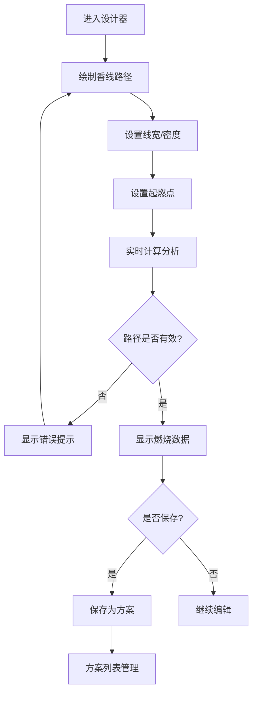

## 1. 产品概述

香篆灰线图案设计器是一款面向香道爱好者和设计师的在线工具，用于设计和模拟香篆燃烧过程。用户可以在画布中绘制连续香线图案，系统自动计算路径长度、预估燃烧时间、检测交叉点和断火风险，并支持保存多种设计方案。

- **核心价值**：将传统香篆艺术与现代计算相结合，帮助用户在实际制作前预览和优化香篆图案
- **目标用户**：香道爱好者、香篆设计师、手工艺从业者
- **市场定位**：专业级香篆设计辅助工具，兼具教育和实用价值

## 2. 核心功能

### 2.1 用户角色

| 角色 | 注册方式 | 核心权限 |
|------|----------|----------|
| 访客用户 | 无需注册 | 使用全部设计功能，方案保存在本地存储 |

### 2.2 功能模块

1. **画布绘制区**：自由绘制连续香线路径，支持撤销/重做/清空
2. **参数控制面板**：线宽设置、香粉密度设置、起燃点选择
3. **计算分析面板**：路径长度、燃烧时长、交叉点数量、断火位置标记
4. **方案管理面板**：保存方案、加载方案、删除方案、方案列表
5. **验证提示系统**：路径连续性检查、参数合法性校验、断点检测

### 2.3 页面详情

| 页面名称 | 模块名称 | 功能描述 |
|-----------|-------------|---------------------|
| 设计器主页 | 顶部导航栏 | 应用标题、方案保存按钮、帮助入口 |
| 设计器主页 | 左侧工具面板 | 绘制工具、线宽/密度设置、起燃点工具 |
| 设计器主页 | 中央画布区域 | 香篆图案绘制主画布，显示路径和标记 |
| 设计器主页 | 右侧分析面板 | 路径数据、燃烧估算、风险提示 |
| 设计器主页 | 底部方案栏 | 已保存方案列表，支持切换和管理 |

## 3. 核心流程

用户打开应用 → 在画布上绘制香线路径 → 调整线宽和密度参数 → 设置起燃点位置 → 查看实时计算结果 → 系统验证路径有效性 → 保存满意的方案 → 可随时加载历史方案继续编辑

## 4. 用户界面设计

### 4.1 设计风格

**东方禅意美学** - 融合传统香道文化与现代极简设计

- **主色调**：深檀色 (#5D4037) 作为主色，搭配米白色 (#F5F0E6) 背景
- **辅助色**：烟灰色 (#9E9E9E)、铜金色 (#B8860B) 作为点缀
- **强调色**：朱砂红 (#C62828) 用于警示和重要标记
- **画布背景**：仿宣纸质感的米白色，带有细微纹理
- **香线颜色**：深灰色路径，燃烧端用橙红色渐变效果

- **按钮风格**：圆角矩形，淡雅配色，悬停有微妙阴影
- **字体**：使用宋体/楷体风格的字体，营造文化氛围
- **布局风格**：三栏式布局，中央画布为核心，左右面板对称分布
- **图标风格**：线性简约图标，融入中式元素

### 4.2 页面设计概述

| 页面名称 | 模块名称 | UI元素 |
|-----------|-------------|----------|
| 设计器主页 | 顶部导航 | 深色背景、白色文字、铜金色点缀 |
| 设计器主页 | 左侧面板 | 卡片式设计、浅米白背景、分组控件 |
| 设计器主页 | 中央画布 | 宣纸质感背景、阴影边框、居中显示 |
| 设计器主页 | 右侧面板 | 数据卡片、渐变统计条、风险指示器 |
| 设计器主页 | 底部方案栏 | 横向滚动卡片、缩略图预览 |

### 4.3 响应式设计

- 桌面端优先设计，三栏布局
- 平板端：左右面板可折叠收起
- 移动端：垂直堆叠布局，画布全屏显示
- 触摸优化：支持触屏绘制，增大按钮点击区域

### 4.4 交互与动画

- 绘制时香线平滑跟随鼠标
- 起燃点标记有呼吸灯动画效果
- 燃烧进度模拟时沿路径有流光效果
- 面板展开/收起有平滑过渡
- 风险提示有淡入动画
