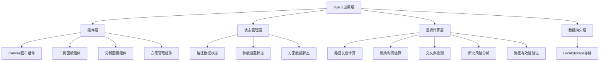

## 1. 架构设计



## 2. 技术描述

- **前端框架**：Vue 3 + TypeScript + Vite
- **样式方案**：TailwindCSS 3
- **状态管理**：Vue 3 响应式 API (reactive/ref) + Pinia
- **画布技术**：HTML5 Canvas API
- **数据存储**：LocalStorage（纯前端，无需后端）
- **图标库**：Lucide Icons

## 3. 目录结构

```
src/
├── components/
│   ├── design/
│   │   ├── IncenseCanvas.vue      # 主画布组件
│   │   ├── ToolPanel.vue          # 左侧工具面板
│   │   ├── AnalysisPanel.vue      # 右侧分析面板
│   │   └── SchemeBar.vue          # 底部方案栏
│   └── ui/
│       ├── SliderInput.vue        # 滑块输入组件
│       ├── DataCard.vue           # 数据卡片组件
│       └── SchemeCard.vue         # 方案卡片组件
├── composables/
│   ├── usePathDrawing.ts          # 路径绘制逻辑
│   ├── usePathCalculation.ts      # 路径计算逻辑
│   ├── usePathValidation.ts       # 路径验证逻辑
│   └── useSchemeStorage.ts        # 方案存储逻辑
├── stores/
│   └── designStore.ts             # 设计器状态管理
├── types/
│   └── incense.ts                 # 类型定义
├── utils/
│   ├── geometry.ts                # 几何计算工具
│   └── constants.ts               # 常量配置
├── pages/
│   └── DesignPage.vue             # 设计器主页
├── App.vue
└── main.ts
```

## 4. 核心数据模型

### 4.1 路径点

```typescript
interface PathPoint {
  x: number;
  y: number;
  timestamp?: number;
}
```

### 4.2 香篆路径

```typescript
interface IncensePath {
  points: PathPoint[];
  lineWidth: number;
  density: number;
  ignitionPoint: PathPoint | null;
}
```

### 4.3 分析结果

```typescript
interface PathAnalysis {
  totalLength: number;
  estimatedBurnTime: number;
  intersectionCount: number;
  breakRiskPoints: PathPoint[];
  isValid: boolean;
  warnings: string[];
}
```

### 4.4 方案数据

```typescript
interface IncenseScheme {
  id: string;
  name: string;
  path: IncensePath;
  analysis: PathAnalysis;
  createdAt: number;
  updatedAt: number;
}
```

## 5. 核心算法

### 5.1 路径长度计算

- 使用欧几里得距离计算相邻点距离并累加
- 计算公式: distance = √((x2-x1)² + (y2-y1)²)

### 5.2 燃烧时间估算

- 基础燃烧速度：假设每厘米香粉燃烧约 30 秒
- 修正因子：线宽越大燃烧越快，密度越高燃烧越慢
- 公式: burnTime = (totalLength / burnRate) * densityFactor * widthFactor

### 5.3 交叉点检测

- 线段相交检测：遍历所有非相邻线段对
- 使用叉积法判断两线段是否相交
- 超过阈值（如 5 个交叉点）时触发警告

### 5.4 断火风险分析

- 检测路径中曲率过大的位置
- 检测路径自交位置（香粉重叠可能导致异常燃烧）
- 检测路径中过于狭窄的位置

## 6. 状态管理

使用 Pinia 管理全局状态，包含：

- **路径状态**：当前绘制的点集合、线宽、密度、起燃点
- **绘制状态**：是否正在绘制、当前工具（画笔/起燃点）
- **分析状态**：计算结果、验证信息、警告列表
- **方案状态**：已保存方案列表、当前选中方案

## 7. 验证规则

1. **路径连续性**：路径必须是单条连续线，不允许有断点
2. **线宽限制**：线宽必须大于 0，合理范围 1-20 像素
3. **密度限制**：密度必须大于 0，合理范围 0.5-3.0
4. **起燃点验证**：起燃点必须落在路径上（距离路径不超过线宽）
5. **交叉点警告**：交叉点超过 5 个时给出风险提示
6. **保存验证**：存在断点或起燃点未设置时不能保存为可用方案
